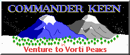
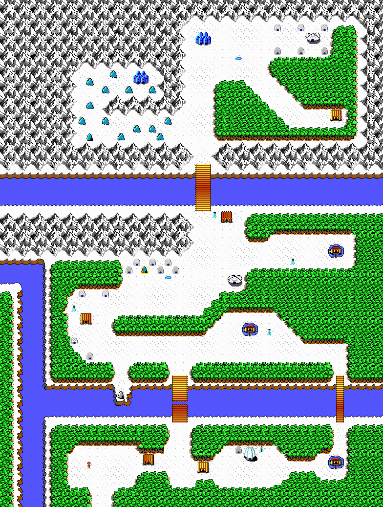

# Commander Keen in Venture to Vorti Peaks

Commander Keen in Venture to Vorti Peaks is a mod for Commander Keen Episode One: Marooned on Mars by id Software. Some notable features of the mod are:

* Skiing (extensive use of slippery ice blocks)
* 16 original levels
* Mostly original graphics

## Story

After saving The Earth from the Vorticon invasion, our hero Billy Blaze decides to take a vacation.
Will he be able to overcome the slippery slopes and jagged cliffs of Vorti Peaks and recover his lost mountaineering equipment?

## World

Venture to Vorti Peaks takes place in a cozy ski resort in the mountain tops.

## Characters

* Billy Blaze

* Penguin (Yorp replacement)

* Yeti (Garg replacement)

* Bully (Vorticon replacement)

* Ice Cube (Butler Robot replacement)

* Snowman (Tank Robot replacement)

## Credits

Some tiles have been copied from other games.

* Several background tiles from Commander Keen Episode Three: Keen Must Die! by id Software
* Wallpaper tile from Dangerous Dave In: The Haunted Mansion by Softdisk
* Brick tiles from [Commander Bleen by Tulip](https://keenwiki.shikadi.net/wiki/Commander_Bleen)
